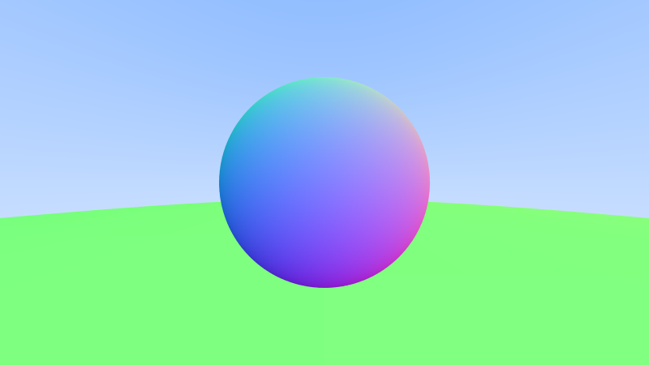
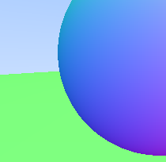
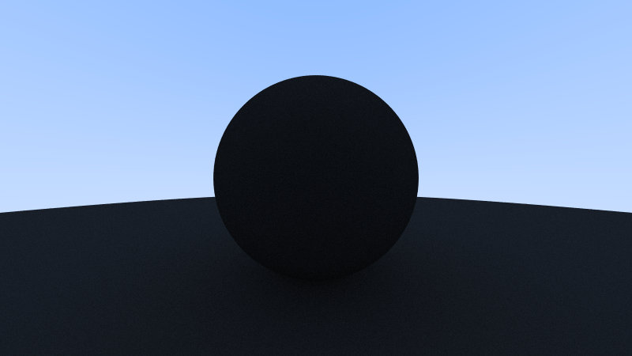
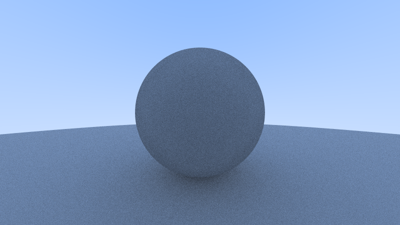

# Implementing basic ray tracing using C

## First PPM file

My first .ppm file

## Canera, rays, and viewport

Gradient based on normalized ray y-values

## Basic sphere-ray interaction

Three spheres that demonstrates perspective

## Shading sphere based on normal vector

Each point on the sphere is shaded based on the vector normal to the surface (pointing outwards)

## Ground is just a humongous sphere in the distance

We actually see two spheres (the ground is actually a massive sphere far off in the distance) rendered using our new hittable and hittable_list.

## Adding some anti-aliasing by setting each pixel color to the average of many samples near the pixel

No anti-aliasing           |  With anti-aliasing
:-------------------------:|:-------------------------:
  |  
  |  

## Matte objects are created by reflecting light in random directions (instead of a single direction which would look glossy)

### The scaling factor below determines how black (0) or how white (1) the surface will look

0.2 scaling         |  0.5 scaling | 0.8 scaling
:-------------------------:|:-------------------------:
  |   | 
